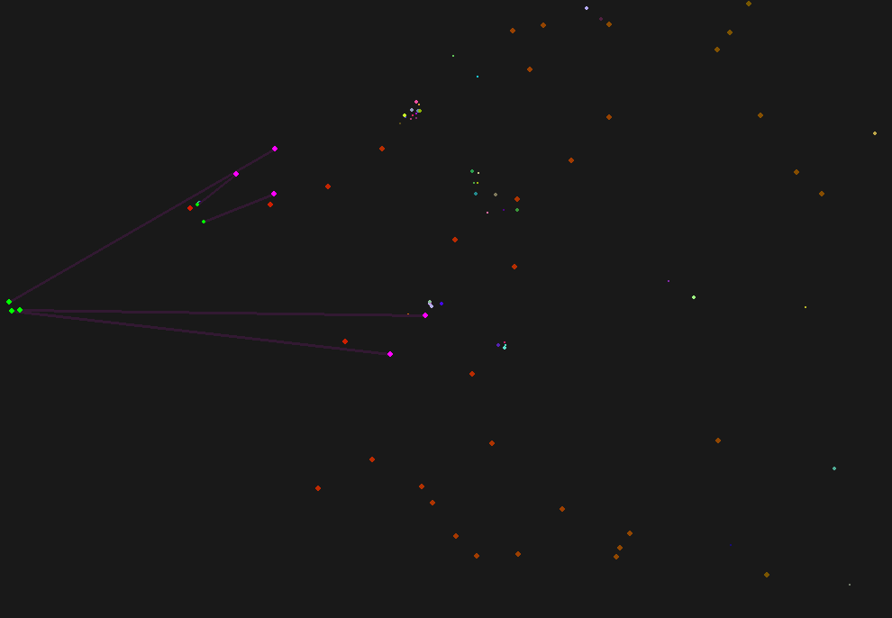

# AntiAir

A visual simulation of missile interception using anti-missiles, created in Python with Pygame. This simulation demonstrates a basic physics model in which missiles are targeted and destroyed by anti-missiles before reaching their destination.



## Features

- **Missile Spawning**: Missiles are randomly generated and move toward a predefined target.
- **Anti-Missile Defense**: Anti-missiles are launched automatically to intercept incoming missiles.
- **Collision and Explosion Effects**: When an anti-missile collides with a missile, an explosion effect is generated.
- **Configurable Simulation**: Easily adjustable constants for missile speed, anti-missile count, screen resolution, and other settings.

## Requirements

- **Python 3.x**
- **Pygame**: Install it via pip with `pip install pygame`

## How to Run

1. Clone the repository:
   ```bash
   git clone https://github.com/your-repo/Missile-Defense-Simulation.git
   cd Missile-Defense-Simulation
   ```

2. Install Pygame if not already installed:
   ```bash
   pip install pygame
   ```

3. Run the simulation:
   ```bash
   python main.py
   ```

## Project Structure

- **`main.py`**: The main script for the simulation. It initializes the screen, handles missile and anti-missile creation, and updates the game loop.
- **`Missile` Class**: Represents enemy missiles moving toward the target.
- **`AntiMissile` Class**: Represents defense missiles that seek and destroy enemy missiles.
- **`Explosion` Effect**: A simple visual effect when a missile is destroyed.

## Customization

All configuration constants are centralized within the script, allowing you to modify:

- **Screen Resolution** (`SCREEN_WIDTH`, `SCREEN_HEIGHT`)
- **Missile Speed** (`MISSILE_SPEED`)
- **Anti-Missile Speed** (`ANTI_MISSILE_SPEED`)
- **Missile Spawn Rate** (`MISSILE_SPAWN_RATE`)
- **Explosion Duration** (`EXPLOSION_LIFESPAN`)

Modify these values to adjust gameplay difficulty and behavior.

## Simulation Details

The simulation models a simple missile defense system:
- **Enemy Missiles**: Spawn from random locations and move toward the target.
- **Anti-Missiles**: Automatically launched to intercept approaching missiles.
- **Explosions**: Generated upon impact, indicating successful interception.

## License

This project is licensed under the Mozilla Public License 2.0 (MPL-2.0).

### Additional Note on Commercial Use
**Commercial use of this software or any derived works is prohibited without prior written permission from the original author.** For commercial licensing inquiries, please contact loan.tremoulet.breton@gmail.com.
